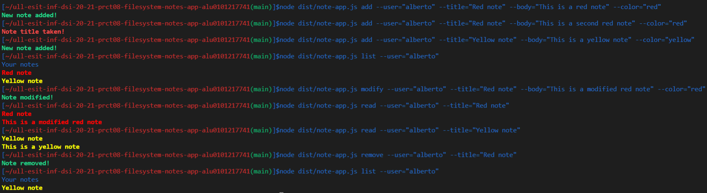

### Autor: Alberto Mendoza Rodríguez (alu0101217741@ull.edu.es)

# Informe Práctica 8 - Aplicación de procesamiento de notas de texto

## 1. Introducción

En este informe se explica la solución diseñada para implementar una aplicación de procesamiento de notas de texto. Esta aplicación permite añadir, modificar, eliminar, listar u leer notas de un usuario concreto. Las notas se almacenan como ficheros JSON en el sistema de ficheros de la máquina que ejecute la aplicación. Cabe destacar que los usuarios sólo pueden interactuar con la aplicación a través de la línea de comandos.

## 2. Objetivos

Los objetivos de esta práctica son:

* Aprender a utilizar los paquetes yargs y chalk.
* Saber utilizar la API síncrona proporcionada por Node.js para trabajar con el sistema de ficheros.

## 3. Tareas previas

1. Antes de empezar con la práctica hay que realizar las siguientes tareas:

2. Aceptar la [asignación de GitHub Classroom](https://classroom.github.com/assignment-invitations/906f18610f5e4a289890edf2c0ceb0f4/status) asociada a esta práctica.
Leer la documentación sobre [yargs](https://www.npmjs.com/package/yargs), [chalk](https://www.npmjs.com/package/chalk) y el [API síncrona proporcionada por Node.js](https://nodejs.org/dist/latest-v15.x/docs/api/fs.html#fs_synchronous_api).

## 4. Explicación de la solución diseñada

En este apartado se explica el diseño que se ha llevado a cabo para realizar la aplicación de procesamiento de notas de texto. Antes de comenzar hay que crear la [estructura básica del proyecto vista en clase](https://ull-esit-inf-dsi-2021.github.io/typescript-theory/typescript-project-setup.html). Además, se sigue la metodología **TDD** por lo que en la estructura del proyecto es necesario añadir el directorio `tests` en el cual se incluyen las pruebas unitarias, que hacen posible confirmar el correcto funcionamiento del software y verificar que es robusto ante entradas no válidas. Para documentar el proyecto se utiliza la herramienta **TypeDoc**. Por último, se incluyen flujos de trabajo de GitHub Actions para realizar las pruebas en distintos entornos con diferentes versiones de Node.js, enviar los datos de cubrimiento a Coveralls, así como producir un análisis de la calidad y seguridad del código fuente a través de Sonar Cloud.

El proyecto está formado por dos ficheros, `note.ts` que incluye la clase **Note** y `note-app.ts` que emplea el paquete **yargs** para que sea posible interactuar con la aplicación desde la línea de comandos. A continuación, se explica cada uno de estos ficheros.

**Código de la clase Note:**

```ts
import * as fs from 'fs';
import * as chalk from 'chalk';

/**
 * Type representing the colors accepted by the system.
 */
export type TypeColor = 'red' | 'green' |'blue' | 'yellow';

/**
 * Class that allows adding, modifying, deleting, listing and reading notes of a specific user.
 */
export class Note {
  /**
   * Private attribute that represents the only instance of the class.
   */
  private static note: Note;

  /**
   * Class constructor.
   */
  private constructor() {}

  /**
   * Method that in the first call creates the only instance of the class.
   * @returns The only instance of the class.
   */
  public static getNotes(): Note {
    if (!fs.existsSync(`notes`)) {
      fs.mkdirSync(`notes`, {recursive: true});
    }
    if (!Note.note) {
      Note.note = new Note();
    }
    return Note.note;
  };

  /**
   * Method that allows adding a note to the list.
   * @param userName The username to add the note.
   * @param title The title of the note.
   * @param message The message that the note contains.
   * @param color The color of the note.
   * @returns A message indicating if the note has been created correctly or if another with the same title already exists.
   */
  addNote(userName: string, title: string, message: string, color: TypeColor): string {
    if (fs.existsSync(`notes/${userName}/${title}.json`)) {
      console.log(chalk.bold.red('Note title taken!'));
      return 'Note title taken!';
    }
    const jsonText = `{"title": "${title}", "message": "${message}", "color": "${color}"}`;
    if (fs.existsSync(`notes/${userName}`)) {
      fs.appendFileSync(`notes/${userName}/${title}.json`, jsonText);
    } else {
      fs.mkdirSync(`notes/${userName}`, {recursive: true});
      fs.appendFileSync(`notes/${userName}/${title}.json`, jsonText);
    }
    console.log(chalk.bold.green('New note added!'));
    return 'New note added!';
  }

  /**
   * Method that allows modifying a note in the list.
   * @param userName The username to modify the note.
   * @param title The title of the note.
   * @param message The message that the note contains.
   * @param color The color of the note.
   * @returns A message indicating if the note has been modified correctly or if the note does not exist.
   */
  modifyNote(userName: string, title: string, message: string, color: TypeColor): string {
    if (!fs.existsSync(`notes/${userName}/${title}.json`)) {
      console.log(chalk.bold.red('The note you want to modify does not exist!'));
      return 'The note you want to modify does not exist!';
    }
    const jsonText = `{"title": "${title}", "message": "${message}", "color": "${color}"}`;
    fs.writeFileSync(`notes/${userName}/${title}.json`, jsonText);
    console.log(chalk.bold.green('Note modified!'));
    return 'Note modified!';
  }

  /**
   * Method to remove a note from the list.
   * @param userName The username to remove the note.
   * @param title The title of the note.
   * @returns A message indicating if the note was not found or if it was successfully deleted.
   */
  removeNote(userName: string, title: string): string {
    if (!fs.existsSync(`notes/${userName}/${title}.json`)) {
      console.log(chalk.bold.red('Note not found'));
      return 'Note not found';
    }
    fs.rmSync(`notes/${userName}/${title}.json`);
    console.log(chalk.bold.green('Note removed!'));
    return 'Note removed!';
  }

  /**
   * Method that lists the titles of all a user's notes.
   * @param userName The username to show the notes.
   * @returns A message with the titles of the notes or an error if the user does not have any saved notes.
   */
  showNotes(userName: string): string {
    if (!fs.existsSync(`notes/${userName}`)) {
      console.log(chalk.bold.red('You have never saved a note'));
      return 'You have never saved a note';
    }
    let textNotes: string = '';
    const filesInDirectory: string[] = fs.readdirSync(`notes/${userName}`);
    console.log('Your notes');
    filesInDirectory.forEach((file) => {
      const contentFile: string = fs.readFileSync(`notes/${userName}/${file}`, {encoding: 'utf-8'});
      const jsonContent = JSON.parse(contentFile);
      console.log(chalk.bold.keyword(jsonContent.color)(jsonContent.title));
      textNotes += jsonContent.title + ' ';
    });
    return textNotes;
  }

  /**
   * Method that allows you to read a specific note from the list.
   * @param userName The username to read a note.
   * @param title The title of the note.
   * @returns A message stating that the note was not found or the titles and content of each note.
   */
  readNote(userName: string, title: string): string {
    if (!fs.existsSync(`notes/${userName}/${title}.json`)) {
      console.log(chalk.bold.red('Note not found'));
      return 'Note not found';
    }
    const contentFile: string = fs.readFileSync(`notes/${userName}/${title}.json`, {encoding: 'utf-8'});
    const jsonContent = JSON.parse(contentFile);
    console.log(chalk.bold.keyword(jsonContent.color)(jsonContent.title +
                                                '\n' + jsonContent.message));
    return jsonContent.title + '\n' + jsonContent.message;
  }
}
```

**Explicación del código:**

En esta clase se emplea la API síncrona de Node.js para que sea posible añadir, modificar, eliminar, listar y leer las notas de un usuario concreto. Con esta clase también se consigue guardar cada nota de la lista en un fichero con formato JSON y que estos ficheros se almacenen en un directorio con el nombre del usuario correspondiente. Cabe destacar que una nota esta formada por un título, un mensaje y un color (rojo, verde, azul o amarillo).

En esta clase he aplicado el patrón de diseño Singleton por lo que el constructor es privado y se dispone del atributo privado estático **note**. Además, se ha declarado un método público estático `getNotes()`, durante la primera invocación a este método se crea la única instancia de la clase, en sucesivas invocaciones al método, se devuelve la instancia de la clase creada durante la primera invocación. En este método también se comprueba si no existe el directorio `notes` y en caso de que esto sea así se crea mediante `fs.mkdirSync('notes', {recursive: true});`.

El método `addNote` permite añadir una nota a la lista. Antes de hacer esto se comprueba mediante  `fs.existsSync('notes/${userName}/${title}.json')` si ese usuario ya tiene una nota con el mismo título, en caso de que así sea entonces se muestra por consola `Note title taken!`, este texto aparecerá en rojo y en negrita `chalk.bold.red` ya que estamos empleando el paquete **chalk**. Si no existe una nota con el mismo título se adaptan los parámetros que ha recibido el método para generar un texto en formato JSON, tras ello con `fs.mkdirSync('notes/${userName}', {recursive: true})` se crea el directorio donde se van a almacenar las notas del usuario, después mediante `fs.appendFileSync('notes/${userName}/${title}.json', jsonText)`  se añaden de forma síncrona datos al fichero que representa la nota, en caso de que el fichero no exista este se crea. Finalmente, se muestra en verde y en negrita el mensaje `New note added!` para indicar que la nota se ha añadido correctamente.

El método `modifyNote` modifica una nota de la lista, primero se comprueba si el usuario tiene alguna nota con el título que se ha pasado como parámetro, en caso de que esto no sea así se muestra por consola `The note you want to modify does not exist!`. Sin embargo, si la nota existe entonces se emplea la constante **jsonText** para hacer que los parámetros que recibe el método estén en formato  JSON y luego se escribe en el fichero donde se encuentra la nota utilizando `fs.writeFileSync('notes/${userName}/${title}.json', jsonText)`, esto hace que se elimine el contenido anterior y se guarde el que hemos establecido en este momento. Por último, se muestra el mensaje `Note modified!` para informar que la modificación se ha realizado adecuadamente.

Para eliminar una nota de la lista se debe emplear `removeNote`. En este método como en los anteriores también se verifica que para el usuario existe una nota con el título indicado, imprimiendo por consola `Note not found` si la nota no existe. En caso contrario se elimina dicha nota empleando `fs.rmSync('notes/${userName}/${title}.json')` y se muestra el mensaje `Note removed!`.

Con `showNotes` se listan los títulos de todas las notas de un usuario, si no se encuentra un directorio con el nombre del usuario esto significa que nunca ha guardado una nota en el sistema por lo que se imprime `You have never saved a note`. Sin embargo, si existe este directorio se obtienen todos los ficheros que se encuentran en él, para ello se emplea `fs.readdirSync('notes/${userName}')` que lee el contenido de un directorio. Tras esto, se recorre la constante **filesInDirectory** que se trata de una array de string con el nombre de los diferentes ficheros, para cada uno de ellos se lee su contenido con `fs.readFileSync('notes/${userName}/${file}', {encoding: 'utf-8'})` y este contenido se convierte a JSON mediante `JSON.parse(contentFile)` para que se pueda acceder fácilmente al título y color. Finalmente con `console.log(chalk.bold.keyword(jsonContent.color)(jsonContent.title))` se muestra el título de la nota con su color correspondiente.  

Por último, el método `readNote` permite leer el contenido de una nota concreta, como se ha hecho en el resto de métodos, primero se comprueba que existe la nota que se quiere leer, en caso de que no sea así se imprime el mensaje `Note not found`. En otro caso, se obtiene el contenido de la nota con `fs.readFileSync('notes/${userName}/${title}.json', {encoding: 'utf-8'})`, este contenido se convierte a JSON empleando `JSON.parse(contentFile)` y se muestran con el color adecuado el título y el mensaje de la nota.

Como se ha podido observar todos los mensajes informativos aparecen en color verde, mientras que los mensajes de error se muestran en color rojo.

**Código del fichero note-app.ts:**

```ts
import * as yargs from 'yargs';
import * as chalk from 'chalk';
import {Note} from './note';

const note = Note.getNotes();

/**
 * Command to add a note to the list.
 */
yargs.command({
  command: 'add',
  describe: 'Add a new note',
  builder: {
    user: {
      describe: 'User who is going to add the note',
      demandOption: true,
      type: 'string',
    },
    title: {
      describe: 'The title of the note',
      demandOption: true,
      type: 'string',
    },
    body: {
      describe: 'The text of the note',
      demandOption: true,
      type: 'string',
    },
    color: {
      describe: 'The color of the note',
      demandOption: true,
      type: 'string',
    },
  },
  handler(argv) {
    if (typeof argv.user === 'string' && typeof argv.title === 'string' &&
        typeof argv.body === 'string' && typeof argv.color === 'string') {
      if (argv.color == 'red' || argv.color == 'green' ||
          argv.color == 'blue' || argv.color == 'yellow') {
        note.addNote(argv.user, argv.title, argv.body, argv.color);
      } else {
        console.log(chalk.bold.red('Note color must be red, green, blue, or yellow'));
      }
    }
  },
});

/**
 * Command to modify a note in the list.
 */
yargs.command({
  command: 'modify',
  describe: 'Modify a note',

  builder: {
    user: {
      describe: 'User who is going to modify a note',
      demandOption: true,
      type: 'string',
    },

    title: {
      describe: 'The title of the note',
      demandOption: true,
      type: 'string',
    },

    body: {
      describe: 'The text of the note',
      demandOption: true,
      type: 'string',
    },

    color: {
      describe: 'The color of the note',
      demandOption: true,
      type: 'string',
    },
  },
  handler(argv) {
    if (typeof argv.body === 'string' && typeof argv.color === 'string' &&
          typeof argv.user === 'string' && typeof argv.title === 'string') {

      if (argv.color != 'blue' && argv.color != 'red' && argv.color != 'yellow' && argv.color != 'green') {
        console.log(chalk.bold.red('Note color must be red, green, blue, or yellow'));

      } else {
        note.modifyNote(argv.user, argv.title, argv.body, argv.color);
      }
    }
  },
});

/**
 * Command to remove a note from the list.
 */
yargs.command({
  command: 'remove',
  describe: 'Delete a note',
  builder: {
    user: {
      describe: 'User who is going to delete the note',
      demandOption: true,
      type: 'string',
    },
    title: {
      describe: 'The title of the note',
      demandOption: true,
      type: 'string',
    },
  },
  handler(argv) {
    if (typeof argv.user === 'string' && typeof argv.title === 'string') {
      note.removeNote(argv.user, argv.title);
    }
  },
});

/**
 * Command to list the titles of a user's notes.
 */
yargs.command({
  command: 'list',
  describe: 'List the titles of the notes',
  builder: {
    user: {
      describe: 'User who will show his notes',
      demandOption: true,
      type: 'string',
    },
  },
  handler(argv) {
    if (typeof argv.user === 'string') {
      note.showNotes(argv.user);
    }
  },
});

/**
 * Command to read a specific note from the list.
 */
yargs.command({
  command: 'read',
  describe: 'Read a specific note from the list',
  builder: {
    user: {
      describe: 'User who will read a note',
      demandOption: true,
      type: 'string',
    },
    title: {
      describe: 'The title of the note',
      demandOption: true,
      type: 'string',
    },
  },
  handler(argv) {
    if (typeof argv.user === 'string' && typeof argv.title === 'string') {
      note.readNote(argv.user, argv.title);
    }
  },
});

/**
 * Process the arguments passed from the command line to the application.
 */
yargs.parse();
```

**Explicación del código:**

En el fichero `note-app.ts` mediante el paquete **yargs** se gestionan diferentes comandos, cada uno de ellos, con sus opciones y manejador correspondiente, con esto se consigue que un usuario solo pueda interactuar con la aplicación de procesamiento de notas de texto a través de la línea de comandos.

En primer lugar, se crea el objeto **note** de la clase **Note**, este se utilizará para invocar los métodos correspondientes según los comandos que el usuario haya ejecutado.Tras ello, se configura el comando `add` con las opciones: `--user`, `--title`, `--body` y `--color`, todas incluyen una descripción, son obligatorias `demandOption: true` y de tipo string `type: 'string'`. El manejador `handler` recibe como parámetro el objeto `argv` que contiene los pares opción-valor del comando, por ejemplo hay que utilizar `argv.title` para acceder al título de la nota. En este manejador se comprueba que todas las opciones sean de tipo string, si esto es así se verifica que el color introducido corresponda a los aceptados por el sistema. Si el color es correcto se invoca al método `addNote`, en otro caso se muestra el mensaje `Note color must be red, green, blue, or yellow`. El comando `modify` es similar al anterior con la diferencia de que en este caso si todo es correcto se invoca al método `modifyNote`. Para eliminar una nota hay que emplear `remove` que tiene como opciones `--user` y `--title`. Si el usuario quiere listar los títulos de todas sus notas debe ejecutar el comando `list` con la opción `--user`. El último comando disponible es `read` con el que se puede leer una nota concreta para lo que hay que indicar las opciones `--user` y `--title`.

Por último, se incluye la sentencia `yargs.parse()` para poder procesar los argumentos pasados desde la línea de comandos a la aplicación.

## 5. Pruebas unitarias realizadas

Las pruebas unitarias desarrolladas para comprobar el correcto funcionamiento del código son las siguientes:

```ts
import 'mocha';
import {expect} from 'chai';
import * as fs from 'fs';
import {Note} from '../src/note';


describe('Note class tests', () => {
  const note = Note.getNotes();

  it('A Note class object can be successfully created', () => {
    expect(note).not.to.be.equal(null);
  });

  it('Note.getNote() returns the objects note', () => {
    expect(Note.getNotes()).to.be.equal(note);
  });

  it('note.addNode("test", "Test note", "This is a test note", "green") returns "New note added!"', () => {
    expect(note.addNote('test', 'Test note', 'This is a test note', 'green')).to.be.equal('New note added!');
    expect(note.addNote('test', 'Test note 2', 'This is second a test note', 'blue')).to.be.equal('New note added!');
  });

  it('The note was created successfully', () => {
    expect(fs.existsSync(`notes/test/Test note.json`)).to.be.equal(true);
  });

  it('note.addNode("test", "Test note", "This is a test note", "green") returns "Note title taken!"', () => {
    expect(note.addNote('test', 'Test note', 'This is a test note', 'green')).to.be.equal('Note title taken!');
  });

  it('note.modifyNote("test", "Test note", "Testing the modify method", "blue") returns "Note modified!"', () => {
    expect(note.modifyNote('test', 'Test note', 'Testing the modify method', 'blue')).to.be.equal('Note modified!');
  });

  it('The file has been modified successfully', () => {
    expect(fs.readFileSync(`notes/test/Test note.json`, {encoding: 'utf-8'})).to.be.equal('{"title": "Test note", "message": "Testing the modify method", "color": "blue"}');
  });

  it('note.modifyNote("test", "Non-existent file", "Testing the modify method", "blue") returns "The note you want to modify does not exist!"', () => {
    expect(note.modifyNote('test', 'Non-existent file', 'Testing the modify method', 'blue')).to.be.equal('The note you want to modify does not exist!');
  });

  it('note.showNotes("test") returns "Test note 2 Test note "', () => {
    expect(note.showNotes('test')).to.be.equal('Test note 2 Test note ');
  });

  it('note.showNotes("Non-existent user") returns "You have never saved a note"', () => {
    expect(note.showNotes('Non-existent user')).to.be.equal('You have never saved a note');
  });

  it('note.readNote("test", "Test note") returns "Test note Testing the modify method"', () => {
    expect(note.readNote('test', 'Test note')).to.be.equal('Test note\nTesting the modify method');
  });

  it('note.readNote("test", "Non-existent file") returns "Note not found"', () => {
    expect(note.readNote('test', 'Non-existent file')).to.be.equal('Note not found');
  });

  it('note.removeNote("test", "Test note") returns "Note removed!"', () => {
    expect(note.removeNote('test', 'Test note')).to.be.equal('Note removed!');
  });

  it('The note has been deleted successfully', () => {
    expect(note.removeNote('test', 'Test note')).to.be.equal('Note not found');
    fs.rmdirSync('./notes', {recursive: true});
  });
});
```

Como se puede observar en primer lugar creo el objeto **note** de la clase **Note** y verifico que este objeto se ha creado correctamente. Tras ello, compruebo el adecuado comportamiento de cada uno de los métodos de la clase.

## 6. Ejemplos de uso de la aplicación

A continuación, se muestran una serie de ejemplos de uso de la aplicación de procesamiento de notas de texto:



Para ver ampliada la imagen haz clic [aquí](img/example_use_application.png).

## 7. Conclusiones

En conclusión, esta práctica me ha permitido familiarizarme con la **API síncrona** proporcionada por **Node.js** para trabajar con el sistema de ficheros. De esta forma he aprendido a crear ficheros en un determinado formato y almacenar en ellos la información que deseaba. Además, gracias a esta API he podido cargar estos ficheros y leer la información que tenían almacenada.

El paquete **chalk** me ha parecido muy útil ya que permite mostrar texto en consola con el estilo que se establezca, lo que ha servido en esta práctica para mostrar en verde los mensajes informativos y en rojo los de error. Por su parte, el paquete **yargs**  que ayuda a crear herramientas de línea de comandos interactivas, considero que es interesante porque proporciona una manera sencilla de interactuar con las aplicaciones.

A diferencia de prácticas anteriores en esta se ha utilizado la herramienta **Sonar Cloud** con la que es posible realizar un análisis de la calidad y seguridad del código fuente, considero que esto tiene gran relevancia porque permite detectar errores y vulnerabilidades en el desarrollo.

Por último, pienso que una vez sabemos la manera en la que trabajar con el lenguaje **TypeScript**, aprender este tipo de herramientas es muy importante para conseguir avanzar como desarrolladores.

